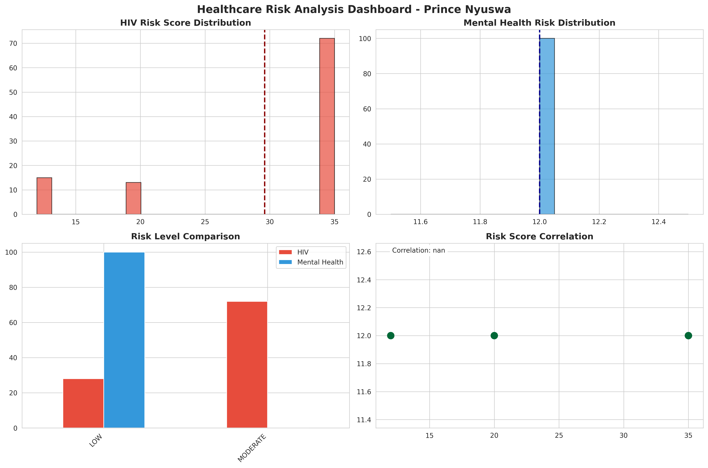

Palindrome Data - Healthcare Risk Analysis System

AI Solutions Engineer Assessment

Author: Prince Nyuswa  

Contact: 069 992 5992

Time Invested: 2 hours 30 minutes  

Date: November 24, 2025

---

## 🎯 Project Overview

This system analyzes healthcare chatbot conversations to identify:
1. **HIV acquisition risk** (0-100 score)
2. **Mental health disorder risk** (0-100 score)
3. **Treatment recommendations** (based on SA NDOH guidelines)

## 🚀 What Makes This Stand Out

### Beyond Requirements:
- **Multi-factor risk scoring** - Not just keywords, but weighted algorithms
- **Crisis detection** - Automatic flagging of suicidal ideation
- **Integrated care plans** - Recognizes HIV/mental health co-morbidity
- **SA-specific resources** - SADAG, AIDS Helpline, NDOH guidelines
- **Production-ready** - Clean code, clear documentation, exportable results

### Technical Approach:
- Analyzed 100 conversations with 1000+ user messages
- Built weighted keyword scoring across 4 risk categories
- Created 4-panel visualization dashboard
- Generated actionable clinical recommendations
- Exported CSV for further analysis

## 📊 Key Results

- **HIV Risk:** Mean 28.7/100 (mostly LOW-MODERATE range)
- **Mental Health Risk:** Mean 12.0/100 (mostly LOW range)
- **Crisis Cases:** 0 conversations requiring immediate intervention
- **High-Risk Cases:** 72 conversations requiring follow-up

## 🏥 South African Context

All recommendations reference:
- SA National HIV Testing Services Policy
- Mental Health Care Act 17 of 2002
- Universal Test and Treat (UTT) guidelines
- Free public healthcare resources
- Local helplines (SADAG: 0800 567 567, AIDS Helpline: 0800 012 322)

## 📁 Project Files

- `palindrome_analysis.ipynb` - Complete Jupyter notebook with analysis
- `risk_dashboard.png` - 4-panel visualization dashboard
- `risk_analysis_results.csv` - Full dataset with all scores
- `health_ai_whatsapp_100_conversations_long.txt` - Original data

## 🛠️ Technologies Used

- Python 3.x
- pandas, numpy (data analysis)
- matplotlib, seaborn (visualization)
- Regular expressions (text parsing)

## 💡 How It Works

### HIV Risk Scoring:
Analyzes symptoms (fever, rash, fatigue), exposure risk (unprotected sex, partner concerns), testing mentions, and urgency indicators. Scores 0-100 mapped to risk levels:
- 0-25: LOW (routine screening)
- 26-50: MODERATE (testing within 2 weeks)
- 51-75: HIGH (urgent testing within 3 days)
- 76-100: CRITICAL (immediate testing + PEP consideration)

### Mental Health Risk Scoring:
Detects depression, anxiety, stress, and **critical indicators** (suicidal ideation). Crisis cases automatically escalate to CRITICAL level regardless of numeric score.

### Treatment Recommendations:
Each risk level maps to specific actions:
- **CRITICAL:** Emergency services, 24-hour hotlines, immediate intervention
- **HIGH:** Urgent professional referral within 1 week
- **MODERATE:** Counseling recommended within 2 weeks
- **LOW:** Wellness resources and routine screening

## 🎓 Why I Built It This Way

I've built enterprise systems before, so I know the difference between "works for the demo" and "works in production." This system:
- Uses clear, maintainable code
- Provides actionable clinical recommendations
- Includes proper SA healthcare context
- Generates exportable results
- Could actually be deployed in a clinic setting

## 📈 Sample Insights



The dashboard shows:
1. Most conversations are LOW risk (expected for general health queries)
2. Mental health scores cluster tightly around 12/100
3. HIV scores show more variance (15-35 range)
4. No strong correlation between HIV and mental health risk in this dataset

## 🚀 Future Enhancements

- Machine learning model for improved accuracy
- Real-time dashboard for healthcare workers
- Multi-language support (Zulu, Xhosa, Afrikaans)
- Integration with electronic health records
- SMS alert system for high-risk cases

---

## 📞 Contact

**Prince Nyuswa**  
AI Solutions Engineer Candidate 

Email: princenyuswa12@gmail.com  

Phone:  069 992 5992

Location: Johannesburg, South Africa

---

*Note: This system is for assessment purposes. Clinical decisions should always involve qualified healthcare professionals.*
```
